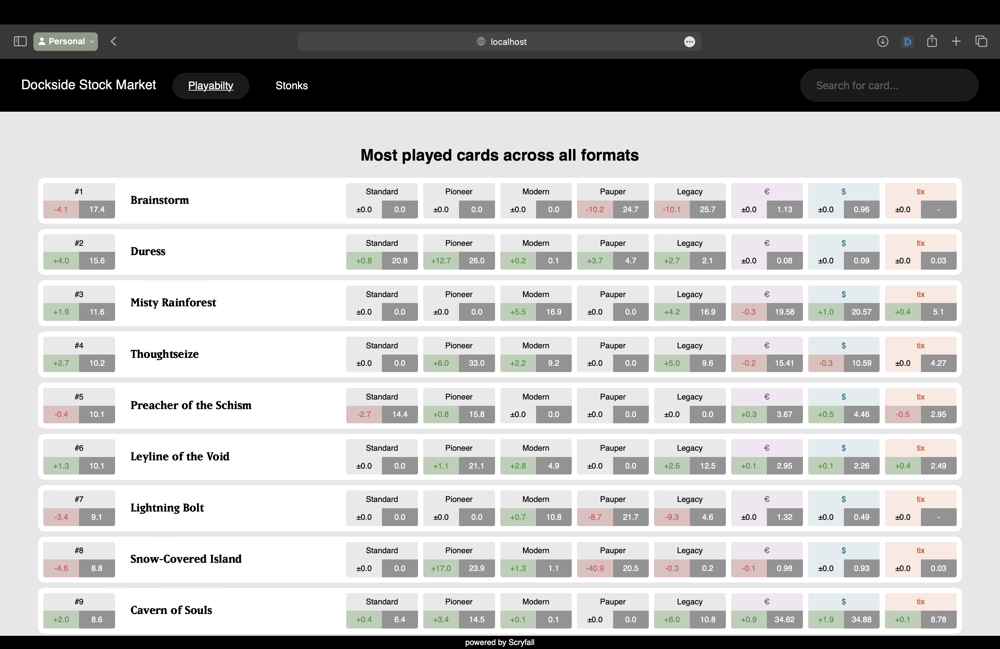
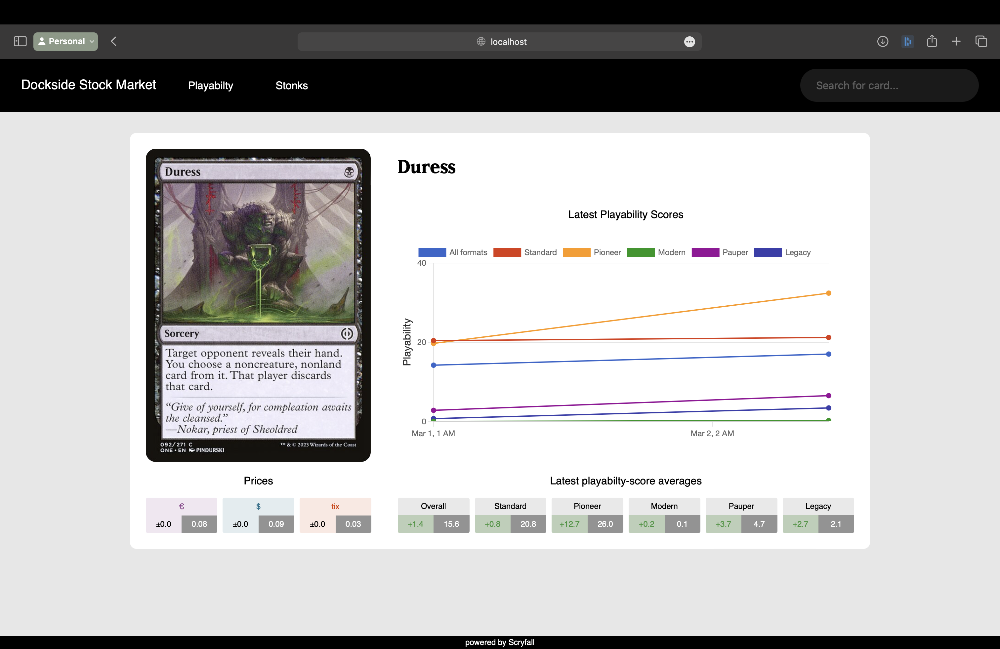
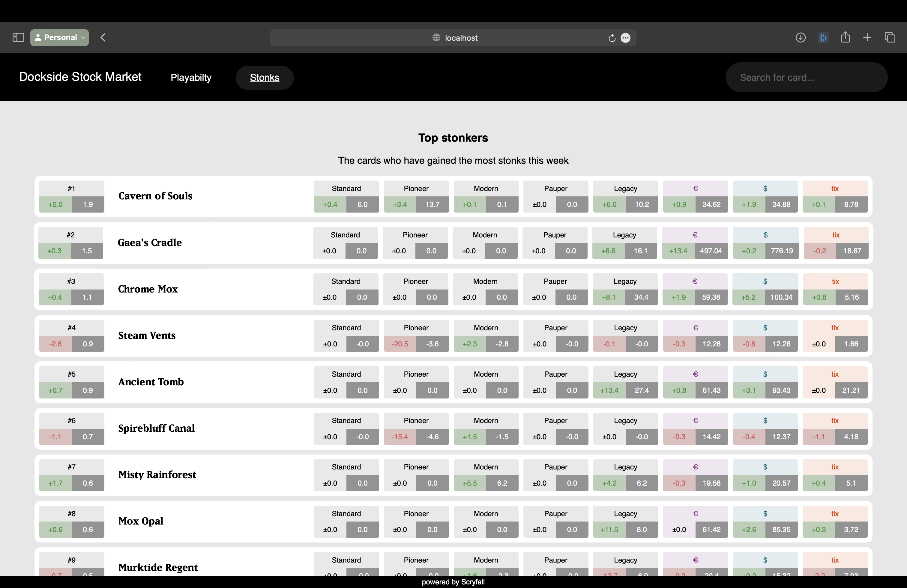
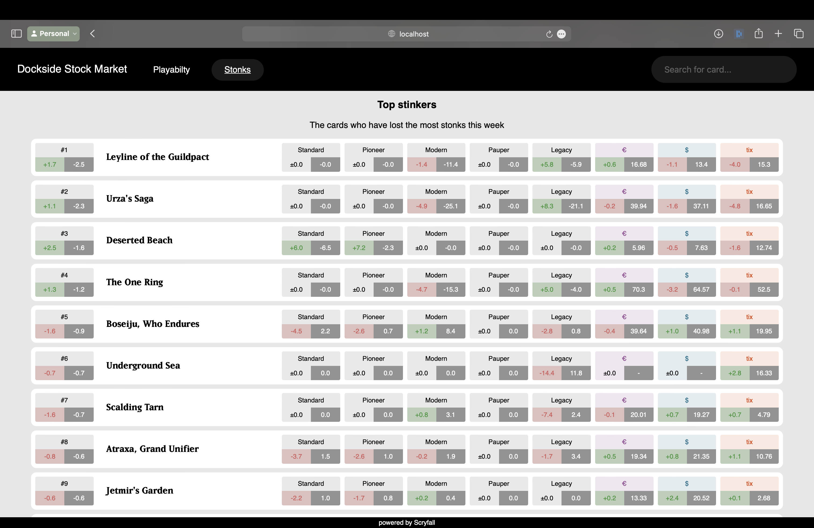

### MTG Builder Hackathon 2024 Project Submission

# Dockside Stock Market

### Introduction

> *"Why is this common so expensive?"*
>
>   – a Standard player looking at Snuff Out

> *"Is this card any good in modern?"*
>
>   – most Jund players, daily

> *"Should I sell my Sheoldred?"*
>
>   – me, slurping on some cup noodles for the fourth time this week

These and more are all questions we hope to have answered with our project idea, the **Dockside Stock Market!**

The Dockside Stock Market (DSM) is a webapp focused on tracking the competitiveness of cards. We at the DSM assume a card is seen as competitive as long as it gets played in tournaments. Thats why we collect new tournament data every day in order to update the **playability scores** (pscores) of all competitively played cards. We then present you, the user, with a platform to look up, track, and compare these playability scores.

We also provide a price history for *all* cards in our tracked formats (currently: Standard, Pioneer, Modern, Pauper, Legacy), which further expands the value of our provided playability scores. Imagine these scenarios:

&rarr; What if a card you own suddenly spikes in pscore, but the market hasn't caught on yet? Thats right, [**stonks**!](https://www.urbandictionary.com/define.php?term=Stonks)

&rarr; What if a card turns out to be overhyped (high demand, low pscore)? Correct, it **stinks**!

**Stonk** and **Stink** are metrics we provide for you based on our collected tournament and price data, resulting in nifty rankings such as Top 10 stonkers and stinkers. The pscores and stonks values of a card are both calculated for each available format, as well as aggregated into an overall score. 

### Biggest challenges and achievements

Being two seasoned full-stack Web Developers, our biggest challenges lay in collecting and interpreting the required data. Our current pscores and stonks values are not yet conclusive enough to reliably confirm any trends. In fact, they are not conclusive enough to confirm that we have implemented our score calculations correcty. But some sleep and the passing of time in itself will provide us with more clarity and more data to look at. Or maybe we'll just shoot Frank Karsten an email, he'll know what to do with the data.

Being two like-minded ex-co-workers also brought some achievements; we lost little time to configuration confusion or tech-stack tutoring. We were up and running without any hiccups and accomplished most of our front-end design goals by sunday.

### Screenshots and impressions

On our landing page, you are greeted with the top played cards across all formats, a.k.a. the highest pscore averages of the last few days (seen to the left of the cardnames on the lower right side of the so called "ticker" box). The following five ticker boxes represent that same average pscore isolated for a single format. And the last three ticker boxes represent changes and averages for prices in $USD, €EUR and TIX. The most played cards for each format are found further down this same page, which coincidentally named "Playability" in the navigation bar. Clicking on any card name leads to its single card view;

Here, you can see tracked pscore values over time in our interactive graph (the colorful squares toggle the visibility of the individual lines). The image is kindly provided by Scryfall's API. For this card here, Duress, we can deduce from the graph that its overall pscore average is most influenced by its pscore in Pioneer, where it serves as additional copy of hand disruption alongside Thoughtseize.

Now switching to our "Stonks" view, you can admire the culmination of our data-hoarding efforts – the Top 10 recent stonkers and stinkers. As some MtG players will observe, the rankings in the screenshots seem bizarre enough to make you believe one of two things; either those scores are so advanced that they pick up on trends invisible to our puny mortal eyes, or they are complete bogus. Seen as none of us are data scientists, we at the DSM tend towards the latter. Mentioned as a pseudo-disclaimer earlier on, we want to repeat that we do not yet have enough datapoints to be certain of any accurate representation of the underlying trends of professional magic play.

> TLDR; Measuring stonks and playability of cards by hoarding tournament and price data.

Thanks for reading,

The DSM crew, Lino & Luca

